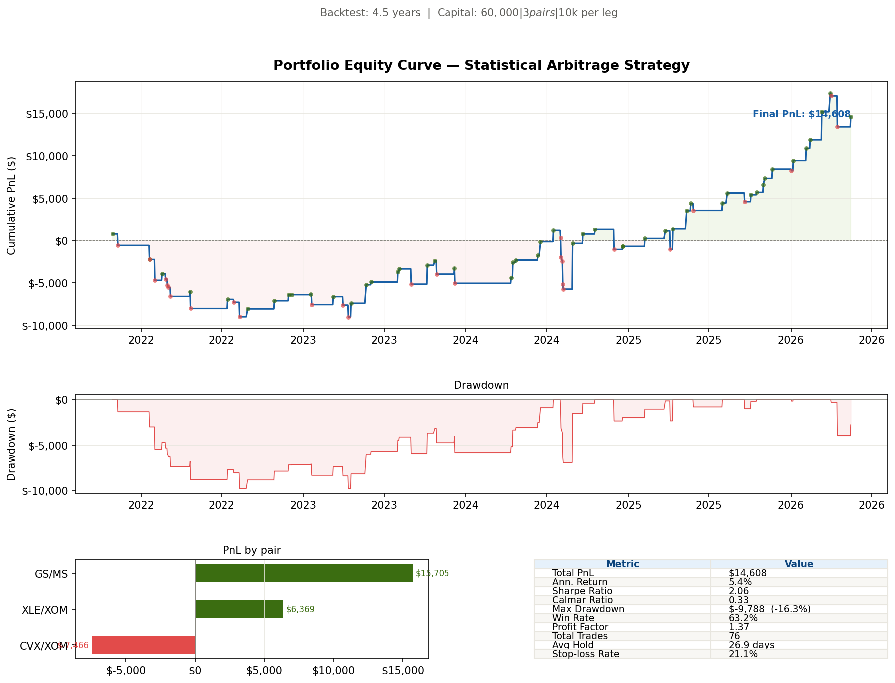
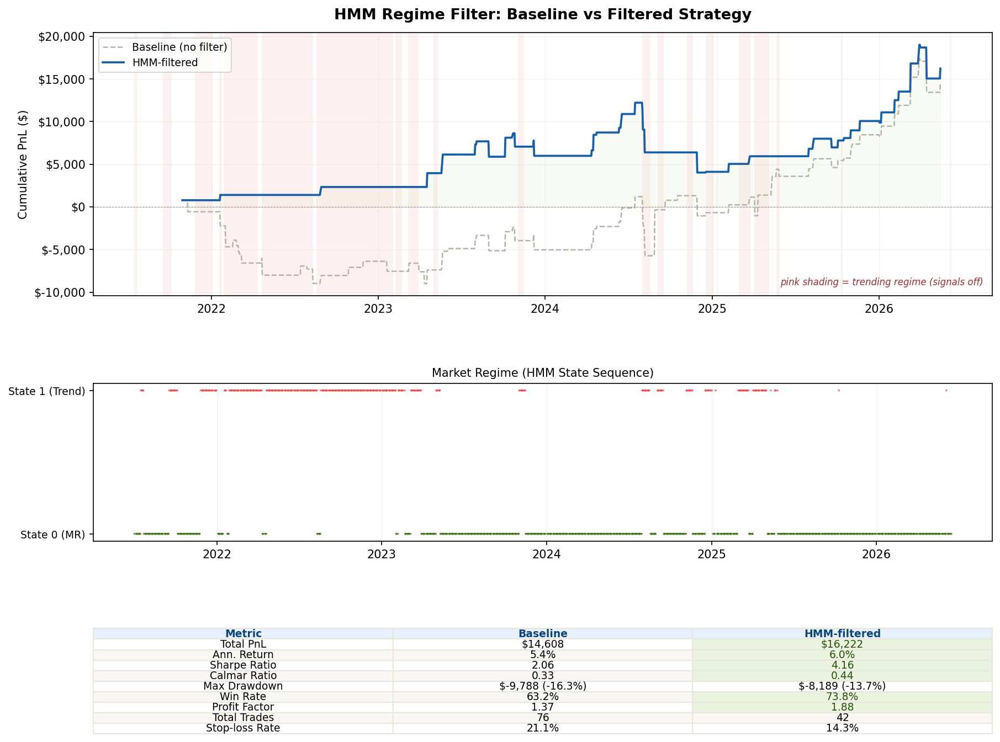

# Statistical Arbitrage Research Platform

Market-neutral quant trading system that automatically finds cointegrated equity pairs, models mean-reversion spreads, and backtests trading signals — with an HMM regime filter and K-Means pair discovery layer. Built in Python + R with MongoDB Atlas.

## Results

| Metric | Baseline | HMM-Filtered |
|---|---|---|
| Sharpe Ratio | 2.06 | **4.16** |
| Win Rate | 63.2% | **73.8%** |
| Total PnL | $14,608 | **$16,222** |
| Max Drawdown | -$9,788 | -$8,189 |
| Trades | 76 | 42 |

> 4.5 year backtest · 3 cointegrated pairs · $10k per leg · 10bps transaction costs





## How it works

**1. Data pipeline (Python)** — 5 years of daily prices for 35 stocks across 6 sectors, stored in MongoDB Atlas.

**2. Correlation scanner (Python)** — tests all 595 unique pairs on log returns, filters to ρ ≥ 0.80, yields 17 candidates.

**3. Cointegration testing (R)** — Engle-Granger test on OLS residuals + half-life via AR(1). 3 pairs pass at p < 0.10 with half-life 5–126 days.

| Pair | p-value | β | Half-life |
|---|---|---|---|
| XLE / XOM | 0.057 | 0.334 | 36 days |
| CVX / XOM | 0.061 | 0.887 | 63 days |
| GS / MS | 0.076 | 5.706 | 26 days |

**4. Spread modeling (R)** — rolling 60-day z-score: `z_t = (S_t − μ) / σ`. Entry at |z| > 2.0, exit at |z| < 0.5, stop-loss at |z| > 3.5.

**5. Signal engine + backtest (Python)** — full trade log with PnL after costs. Sharpe, Calmar, profit factor, max drawdown.

**6. HMM regime filter (Python)** — 2-state Gaussian HMM on market features detects mean-reverting vs trending regimes. Filters out trades in trending regime. Sharpe: 2.06 → **4.16**.

**7. K-Means clustering (Python)** — clusters stocks by return profile (vol, beta, momentum, skewness). Independently rediscovered MA/V as cointegrated (p=0.087, hl=55d), validating manual analysis.

## Stack

Python · R · MongoDB Atlas · yfinance · statsmodels · hmmlearn · scikit-learn · ggplot2 · urca · tseries

## Setup

```bash
git clone https://github.com/yourusername/stat-arb-platform.git
cd stat-arb-platform
pip install -r requirements.txt
echo 'MONGO_URI=mongodb+srv://<user>:<pass>@cluster.mongodb.net' > src/.env

python src/phase1_data_pipeline.py
python src/correlation_scanner.py
# In RStudio: source("src/cointegration.R") then source("src/spread_modeling.R")
python src/signal_engine.py
python src/phase6_backtest.py
python src/hmm.py
python src/kmeans.py
```

## Structure

```
src/
├── db.py                    # MongoDB connection layer
├── phase1_data_pipeline.py  # Data ingestion
├── correlation_scanner.py   # Pair scanning
├── cointegration.R          # Engle-Granger + half-life (R)
├── spread_modeling.R        # Z-score + signal charts (R)
├── signal_engine.py         # Trade log generation
├── phase6_backtest.py       # Equity curve + metrics
├── hmm.py                   # Regime detection
└── kmeans.py                # ML pair discovery
```


